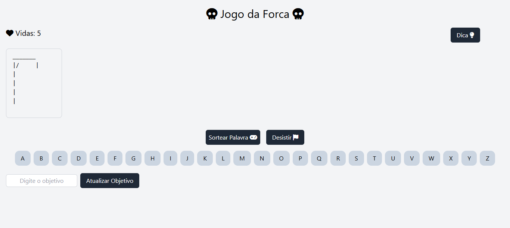

# 🪓 **Jogo da Forca**

Este é um projeto de **Jogo da Forca** desenvolvido em HTML, CSS, e JavaScript. Ele desafia os jogadores a adivinharem palavras enquanto gerenciam suas tentativas erradas. Um jogo divertido e simples que explora lógica e manipulação de DOM.

## 📋 **Funcionalidades**

- **Sortear Palavras**: Opção de selecionar uma palavra aleatória para adivinhar.
- **Definir Objetivo Personalizado**: Permite que o jogador insira sua própria palavra secreta.
- **Indicadores Visuais**: Exibição do boneco da forca conforme os erros aumentam.
- **Sistema de Vidas**: Jogador começa com 5 tentativas e perde ao errar todas.
- **Dicas Progressivas**: Dicas revelam gradualmente letras da palavra ao jogador.
- **Botão de Reinício**: Reseta o jogo e permite começar novamente com uma nova palavra.
- **Design Responsivo**: Adaptado para diferentes dispositivos, com suporte a TailwindCSS.

## 🚀 **Como Jogar**

1. **Escolha o Objetivo**:
   - Digite uma palavra personalizada no campo de texto ou clique em "Sortear Palavra" para selecionar uma palavra aleatória.

2. **Faça uma Jogada**:
   - Clique nas letras disponíveis para adivinhar a palavra.
   - Cada erro adiciona uma parte ao boneco da forca. Você tem 5 vidas!

3. **Use as Dicas**:
   - Clique no botão de "Dica" para revelar partes da palavra. Após duas dicas, o botão ficará indisponível.

4. **Reinicie o Jogo**:
   - Clique no botão "Desistir" para encerrar a partida e revelar a palavra.

## 🛠️ **Tecnologias Utilizadas**

- **HTML**: Estrutura básica do jogo.
- **CSS/TailwindCSS**: Estilização e design responsivo.
- **JavaScript**: Lógica do jogo, manipulação de eventos e DOM.
- **Font Awesome**: Ícones para a interface.
- **Favicon**: Ícones personalizados para o navegador.

## 🖼️ **Prévia**



## 📦 **Como Executar o Projeto**

### 1. Clone o repositório:

```bash
git clone https://github.com/eduardomarcolin09/Jogo_Da_Forca.git
```

### 2. Acesse a pasta do projeto:

```bash
cd Jogo_Da_Forca
```

### 3. Abra o arquivo index.html em um navegador.

## 📝 **Melhorias Futuras**

- Adicionar níveis de dificuldade, como palavras mais longas ou mais tentativas.
- Implementar cronômetro para limitar o tempo de cada jogada.
- Exibir histórico de palavras jogadas ao final.

## 📚 **Notas Finais**

- Este projeto foi desenvolvido como uma prática de programação e é aberto a sugestões e melhorias.
- Caso encontre algum bug ou comportamento inesperado, sinta-se à vontade para abrir uma issue no repositório.
- O Jogo da Forca foi projetado para ser simples e divertido, com foco no aprendizado de manipulação de DOM e lógica em JavaScript.
- **Divirta-se jogando e explorando o código! 😊**